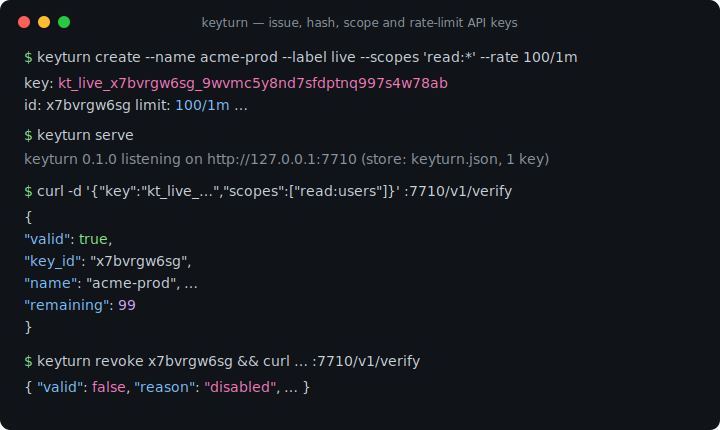
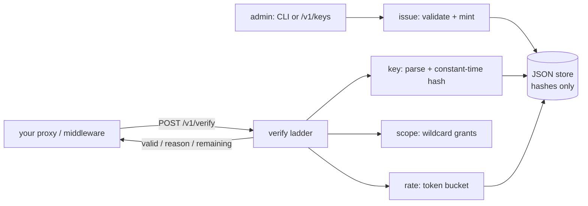

# keyturn

[English](README.md) | [中文](README.zh.md) | [日本語](README.ja.md)

[](LICENSE) [](go.mod) [](CHANGELOG.md)  [](CONTRIBUTING.md)

**keyturn：API キーの発行・ハッシュ化・スコープ付与・レート制限を 1 つの検証エンドポイントで提供するオープンソースの API キーサービス —— プロキシが呼び出すサイドカーであって、移行を強いるゲートウェイ基盤ではない。**



```bash
git clone https://github.com/JaydenCJ/keyturn && cd keyturn
go build -o keyturn ./cmd/keyturn    # single static binary, stdlib only
```

> プレリリース：v0.1.0 はまだどのパッケージレジストリにも公開されていません。上記の手順でソースからビルドしてください（Go ≥1.22 なら何でも可）。

## なぜ keyturn？

どの API プロダクトも最終的に同じ 4 つの車輪を再発明します：キー生成、ハッシュ保存、スコープ検査、キー単位のレート制限 —— そして既製の答えにはどれも条件が付いてきます。Unkey のようなホスト型キーサービスは優秀ですがクラウド前提で、認可経路が他社の稼働率に依存し、キーのハッシュも社外に置かれます。API ゲートウェイ基盤（Kong、Tyk）はキー認証をルーティング層・データベース・プラグイン生態系と抱き合わせ、丸ごと採用するしかありません。自作は簡単に見えて、定数時間比較、再起動を生き延びるトークンバケット、確実に伝播する失効、そして「シークレット違い」と「キー不明」が別のエラーを返す微妙な漏えいという細部で躓きます。keyturn はその欠けた中間層です：単一の JSON ファイルを持つ単一の静的バイナリが `POST /v1/verify` だけを公開します。プロキシやミドルウェアが提示されたキーとルートが要求するスコープを送ると、keyturn は `valid` と安定した理由コード、残り枠を返します。キーは bearer トークン付き管理 API でも、完全オフラインの CLI でも発行可能 —— トークンバケットはストアファイルに永続化されるので、CLI だけの構成でもサーバーゼロで本物のレート制限が得られます。

| | keyturn | Unkey | Kong / Tyk | 自作 |
|---|---|---|---|---|
| 単一エンドポイントの検証サイドカー | ✅ | ❌ SDK + クラウド API | ❌ 経路にゲートウェイ一式 | 自分で書く |
| 完全オフライン / 隔離網で動作 | ✅ | ❌ ホスト型前提 | ⚠️ セルフホスト + DB | ✅ |
| キーをハッシュ化して保存（SHA-256、定数時間比較） | ✅ | ✅ | ⚠️ プラグイン次第 | よく忘れられる |
| ワイルドカード付与対応のスコープ（`read:*`） | ✅ | ✅ | ⚠️ ACL プラグイン | 自分で書く |
| 正確な再試行ヒント付きトークンバケット | ✅ | ✅ | ✅ | 自分で書く |
| シークレット違い ≡ キー不明（ID 探索防止） | ✅ | ❓ 文書なし | ❓ 文書なし | 大抵漏れる |
| 必要なインフラ | なし —— バイナリ 1 つ + JSON 1 つ | 先方のクラウド | DB + ゲートウェイノード | なし |
| ランタイム依存 | 0 | n/a（SaaS） | 数十個 | まちまち |

<sub>依存数は 2026-07-13 に確認：keyturn は Go 標準ライブラリのみを import。Kong 3.x は PostgreSQL/DB-less 設定層と 90+ の Lua rocks を同梱。</sub>

## 特長

- **統合するのは 1 エンドポイントだけ** —— `POST /v1/verify` が `{key, scopes, cost}` を受け取り `{valid, reason, remaining, retry_after_ms}` を返す。確定的な回答はすべて HTTP 200 なので、転送障害と拒否が混同されることはない。
- **シークレットは一瞬だけ存在** —— 完全なキーは作成時に一度だけ表示。ストアには SHA-256 ハッシュのみを保持し定数時間で比較、`not_found` は未知の ID とシークレット違いを意図的に同一扱いする。
- **スコープを本気で扱う** —— `read:*` や `billing:invoices:create` を付与し、ルートごとに要求。拒否された要求は不足スコープを正確に報告し —— レート制限トークンは消費しない。
- **決定論的なトークンバケット** —— キー単位の `--rate 100/1m --burst 250`、連続補充と正直な `retry_after` ヒント。リミッターは注入時計の純関数で、だからこそ 89 個のテストに sleep が 1 つもない。
- **インフラゼロ** —— 静的バイナリ 1 つと、アトミックに 0600 権限で書かれる可読 JSON ストア 1 つ。CLI は消費トークンをファイルへ書き戻すため、サーバーレス構成でも呼び出しをまたいで正しく制限できる。
- **デフォルトで施錠** —— 127.0.0.1 にバインド、テレメトリなし、起動時の通信なし。bearer トークン未設定なら管理 API は丸ごと無効。

## クイックスタート

```bash
# 1. mint a key (the full key is printed once, then only its hash exists)
./keyturn create --name acme-prod --label live --scopes 'read:*,write:orders' --rate 100/1m

# 2. run the sidecar
./keyturn serve

# 3. your proxy/middleware verifies each request with one POST
curl -s http://127.0.0.1:7710/v1/verify \
  -d '{"key":"kt_live_x7bvrgw6sg_9wvmc5y8nd7sfdptnq997s4w78ab","scopes":["read:users"]}'
```

実際にキャプチャした出力：

```text
key:     kt_live_x7bvrgw6sg_9wvmc5y8nd7sfdptnq997s4w78ab
id:      x7bvrgw6sg
name:    acme-prod
scopes:  read:*, write:orders
limit:   100/1m
expires: never
save this key now — keyturn stores only its hash and cannot show it again

keyturn 0.1.0 listening on http://127.0.0.1:7710 (store: keyturn.json, 1 key)
admin API: disabled (set --admin-token or KEYTURN_ADMIN_TOKEN to enable)

{
  "valid": true,
  "key_id": "x7bvrgw6sg",
  "name": "acme-prod",
  "label": "live",
  "scopes": [
    "read:*",
    "write:orders"
  ],
  "remaining": 99
}
```

拒否経路も同じく明示的（実出力、キーが持たないスコープを要求）：

```text
{
  "valid": false,
  "reason": "missing_scope",
  "key_id": "x7bvrgw6sg",
  "name": "acme-prod",
  "label": "live",
  "scopes": [
    "read:*",
    "write:orders"
  ],
  "missing_scopes": [
    "admin:all"
  ],
  "remaining": -1
}
```

CI や cron のキーにサーバーは不要 —— CLI がオフラインで検証し、トークンバケットをストアファイルに永続化します：

```bash
./keyturn verify kt_live_… --scopes read:users   # exit 0 valid, 1 denied
```

## 拒否理由

検証ラダーは固定順で実行され —— 解析 → 照合 → ハッシュ → 失効 → 期限 → スコープ → レート制限 —— 最初に失敗した段が答えを返します。ワイヤレベルの完全な参照は [docs/verification-api.md](docs/verification-api.md)。

| 理由 | 意味 | 備考 |
|---|---|---|
| `malformed` | keyturn のキーの形をしていない | 理由の詳細は明かさない |
| `not_found` | 未知の ID **または**シークレット違い | 意図的に同一 —— ID 探索を防ぐ |
| `disabled` | CLI か管理 API で失効済み | `enable` で復活 |
| `expired` | `--expires` を超過 | 排他境界：その瞬間*に*失効 |
| `missing_scope` | 要求スコープをキーが持たない | 不足を列挙；トークンは消費しない |
| `rate_limited` | トークンバケットが空 | `retry_after_ms` は正直なヒント |

## CLI リファレンス

`keyturn [create|list|show|revoke|enable|delete|verify|serve|version]` —— 全コマンドが `--store PATH`（既定は `$KEYTURN_STORE` か `keyturn.json`）を読みます。終了コード：0 成功/有効、1 拒否、2 使い方誤り、3 実行時エラー。

| フラグ | 既定値 | 効果 |
|---|---|---|
| `--name`（create） | 必須 | 人間が読めるキー名、80 文字以下 |
| `--label`（create） | なし | キー文字列に埋め込む区分。例：`live`、`test` |
| `--scopes` | なし | カンマ区切りの付与（create）または要求（verify） |
| `--rate`（create） | 無制限 | `N/窓`：`100/1m`、`10/s`、`5000/24h` |
| `--burst`（create） | = レート数 | バースト用のバケット容量 |
| `--expires`（create） | 無期限 | RFC 3339 か `YYYY-MM-DD`（UTC 0 時） |
| `--meta`（create） | なし | `k=v` 注釈、繰り返し可 |
| `--cost`（verify） | `1` | この呼び出しが消費するトークン数 |
| `--format` | `text` | `text` か `json`（JSON は HTTP ワイヤ形式と一致） |
| `--addr`（serve） | `127.0.0.1:7710` | 待受アドレス。非ループバックは警告を表示 |
| `--admin-token`（serve） | `$KEYTURN_ADMIN_TOKEN` | `/v1/keys` を有効化。未設定 = 管理 API 無効 |

## 検証

このリポジトリは CI を同梱しません。上記の主張はすべてローカル実行で検証されます：

```bash
go test ./...            # 89 deterministic tests, offline, < 5 s
bash scripts/smoke.sh    # CLI + real sidecar end-to-end, prints SMOKE OK
```

## アーキテクチャ



## ロードマップ

- [x] v0.1.0 —— ラベル/スコープ/期限/メタデータ付きハッシュキー発行、ワイルドカードスコープ照合、永続トークンバケット、単一エンドポイント HTTP サイドカー + bearer トークン管理 API、オフライン CLI 検証、89 テスト + smoke スクリプト
- [ ] サーバー側バケット状態の定期 + 終了時ストア書き戻し（現状は再起動でバケットが満杯に戻る）
- [ ] `keyturn rotate ID` —— シークレットを再発行し、スコープ/制限/ID 系譜を維持
- [ ] 検証結果のキャッシュヘッダー（サブミリ秒プロキシ向け `Cache-Control` ヒント）
- [ ] 非ループバック配備向けの、プロキシとサイドカー間の任意 mTLS
- [ ] 同一インターフェース裏の SQLite ストアバックエンド（>100k キー対応）

完全な一覧は [open issues](https://github.com/JaydenCJ/keyturn/issues) を参照。

## コントリビュート

Issue・議論・PR を歓迎します —— ローカルの作業手順（フォーマット、vet、テスト、`SMOKE OK`）は [CONTRIBUTING.md](CONTRIBUTING.md) へ。入門しやすい課題は [good first issue](https://github.com/JaydenCJ/keyturn/issues?q=is%3Aissue+is%3Aopen+label%3A%22good+first+issue%22)、設計の議論は [Discussions](https://github.com/JaydenCJ/keyturn/discussions) で。

## ライセンス

[MIT](LICENSE)
