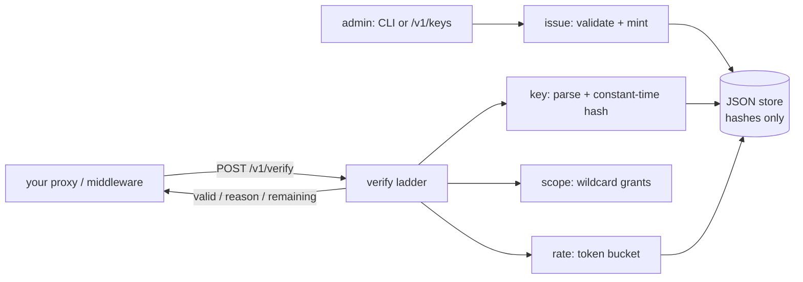

# keyturn

[English](README.md) | [中文](README.zh.md) | [日本語](README.ja.md)

[](LICENSE) [](go.mod) [](CHANGELOG.md)  [](CONTRIBUTING.md)

**keyturn：an open-source API key service that issues, hashes, scopes and rate-limits keys behind one verification endpoint — a sidecar your proxy calls, not a gateway platform you migrate to.**


```bash
git clone https://github.com/JaydenCJ/keyturn && cd keyturn
go build -o keyturn ./cmd/keyturn    # single static binary, stdlib only
```

> Pre-release: v0.1.0 is not tagged on a package registry yet; build from source as above (any Go ≥1.22).

## Why keyturn?

Every API product eventually rebuilds the same four things: key generation, hashed storage, scope checks, and per-key rate limits — and the off-the-shelf answers all come with strings attached. Hosted key services like Unkey are excellent but cloud-first: your authorization path now depends on someone else's uptime and your keys' hashes live off-premises. API gateway platforms (Kong, Tyk) bundle key auth with a routing layer, a database, and a plugin ecosystem you must adopt wholesale. Hand-rolling looks easy until you meet the details: constant-time comparison, token buckets that survive restarts, revocation that actually propagates, and the subtle leak where "wrong secret" and "unknown key" return different errors. keyturn is the missing middle: a single static binary holding a single JSON file, exposing `POST /v1/verify`. Your proxy or middleware sends the presented key and the scopes the route demands; keyturn answers `valid` plus a stable reason and remaining budget. Issue keys over a bearer-token admin API or entirely offline via the CLI — the token bucket even persists in the store file, so CLI-only setups get real rate limiting with zero servers.

| | keyturn | Unkey | Kong / Tyk | hand-rolled |
|---|---|---|---|---|
| One-endpoint verification sidecar | ✅ | ❌ SDK + cloud API | ❌ full gateway in the path | you write it |
| Runs fully offline / air-gapped | ✅ | ❌ hosted-first | ⚠️ self-host + DB | ✅ |
| Keys hashed at rest (SHA-256, constant-time compare) | ✅ | ✅ | ⚠️ plugin-dependent | often forgotten |
| Scopes with wildcard grants (`read:*`) | ✅ | ✅ | ⚠️ ACL plugin | you write it |
| Token-bucket limits with exact retry hints | ✅ | ✅ | ✅ | you write it |
| Wrong secret ≡ unknown key (no ID probing) | ✅ | ❓ undocumented | ❓ undocumented | usually leaks |
| Infrastructure required | none — 1 binary + 1 JSON file | their cloud | DB + gateway nodes | none |
| Runtime dependencies | 0 | n/a (SaaS) | dozens | varies |

<sub>Dependency counts checked 2026-07-13: keyturn imports the Go standard library only; Kong 3.x ships with a bundled PostgreSQL/DB-less config layer and 90+ Lua rocks.</sub>

## Features

- **One endpoint to integrate** — `POST /v1/verify` takes `{key, scopes, cost}` and answers `{valid, reason, remaining, retry_after_ms}`; every definitive answer is HTTP 200, so transport failures and denials can never be confused.
- **Secrets exist for one moment** — the full key is shown exactly once at creation; the store keeps only a SHA-256 hash, compared in constant time, and `not_found` deliberately covers both unknown IDs and wrong secrets.
- **Scoped like you mean it** — grant `read:*` or `billing:invoices:create`, demand scopes per route, and denied requests report exactly which scopes were missing — without spending rate-limit tokens.
- **Token buckets, deterministically** — per-key `--rate 100/1m --burst 250` limits with continuous refill and honest `retry_after` hints; the limiter is a pure function of an injected clock, which is why all 89 tests run without a single sleep.
- **Zero infrastructure** — one static binary, one human-readable JSON store written atomically with 0600 permissions; the CLI persists spent tokens to the file, so even server-less setups rate-limit correctly across invocations.
- **Locked-down by default** — binds 127.0.0.1, no telemetry, no network at startup; the admin API is disabled entirely unless you configure a bearer token.

## Quickstart

```bash
# 1. mint a key (the full key is printed once, then only its hash exists)
./keyturn create --name acme-prod --label live --scopes 'read:*,write:orders' --rate 100/1m

# 2. run the sidecar
./keyturn serve

# 3. your proxy/middleware verifies each request with one POST
curl -s http://127.0.0.1:7710/v1/verify \
  -d '{"key":"kt_live_x7bvrgw6sg_9wvmc5y8nd7sfdptnq997s4w78ab","scopes":["read:users"]}'
```

Real captured output:

```text
key:     kt_live_x7bvrgw6sg_9wvmc5y8nd7sfdptnq997s4w78ab
id:      x7bvrgw6sg
name:    acme-prod
scopes:  read:*, write:orders
limit:   100/1m
expires: never
save this key now — keyturn stores only its hash and cannot show it again

keyturn 0.1.0 listening on http://127.0.0.1:7710 (store: keyturn.json, 1 key)
admin API: disabled (set --admin-token or KEYTURN_ADMIN_TOKEN to enable)

{
  "valid": true,
  "key_id": "x7bvrgw6sg",
  "name": "acme-prod",
  "label": "live",
  "scopes": [
    "read:*",
    "write:orders"
  ],
  "remaining": 99
}
```

Deny paths are just as explicit (real output, demanding a scope the key lacks):

```text
{
  "valid": false,
  "reason": "missing_scope",
  "key_id": "x7bvrgw6sg",
  "name": "acme-prod",
  "label": "live",
  "scopes": [
    "read:*",
    "write:orders"
  ],
  "missing_scopes": [
    "admin:all"
  ],
  "remaining": -1
}
```

No server needed for CI or cron keys — the CLI verifies offline and persists the token bucket in the store file:

```bash
./keyturn verify kt_live_… --scopes read:users   # exit 0 valid, 1 denied
```

## Denial reasons

The verification ladder runs in a fixed order — parse → lookup → hash → revoked → expired → scopes → rate limit — and the first failing rung answers. Full wire reference in [docs/verification-api.md](docs/verification-api.md).

| Reason | Meaning | Notes |
|---|---|---|
| `malformed` | not shaped like a keyturn key | never reveals why |
| `not_found` | unknown ID **or** wrong secret | identical on purpose — no ID probing |
| `disabled` | revoked via CLI or admin API | `enable` restores it |
| `expired` | past `--expires` | exclusive boundary: dead *at* the instant |
| `missing_scope` | key lacks a demanded scope | lists them; spends no tokens |
| `rate_limited` | token bucket empty | `retry_after_ms` is an honest hint |

## CLI reference

`keyturn [create|list|show|revoke|enable|delete|verify|serve|version]` — every command reads `--store PATH` (default `$KEYTURN_STORE` or `keyturn.json`). Exit codes: 0 ok/valid, 1 denied, 2 usage, 3 runtime.

| Flag | Default | Effect |
|---|---|---|
| `--name` (create) | required | human-readable key name, ≤80 chars |
| `--label` (create) | none | segment baked into the key string, e.g. `live`, `test` |
| `--scopes` | none | comma-separated grants (create) or demands (verify) |
| `--rate` (create) | unlimited | `N/window`: `100/1m`, `10/s`, `5000/24h` |
| `--burst` (create) | = rate count | bucket capacity for spikes |
| `--expires` (create) | never | RFC 3339 or `YYYY-MM-DD` (midnight UTC) |
| `--meta` (create) | none | `k=v` annotations, repeatable |
| `--cost` (verify) | `1` | tokens this call spends |
| `--format` | `text` | `text` or `json` (JSON matches the HTTP wire shape) |
| `--addr` (serve) | `127.0.0.1:7710` | listen address; non-loopback prints a warning |
| `--admin-token` (serve) | `$KEYTURN_ADMIN_TOKEN` | enables `/v1/keys`; unset = admin API off |

## Verification

This repository ships no CI; every claim above is verified by local runs:

```bash
go test ./...            # 89 deterministic tests, offline, < 5 s
bash scripts/smoke.sh    # CLI + real sidecar end-to-end, prints SMOKE OK
```

## Architecture



## Roadmap

- [x] v0.1.0 — hashed key issuance with labels/scopes/expiry/metadata, wildcard scope matching, persistent token buckets, one-endpoint HTTP sidecar + bearer-token admin API, offline CLI verification, 89 tests + smoke script
- [ ] Periodic + shutdown flush of server-side bucket state to the store (restarts currently refill buckets)
- [ ] `keyturn rotate ID` — reissue the secret, keep scopes/limits/ID lineage
- [ ] Verification result cache header (`Cache-Control` hints for sub-millisecond proxies)
- [ ] Optional mTLS between proxy and sidecar for non-loopback deployments
- [ ] SQLite store backend behind the same interface for >100k keys

See the [open issues](https://github.com/JaydenCJ/keyturn/issues) for the full list.

## Contributing

Issues, discussions and pull requests are welcome — see [CONTRIBUTING.md](CONTRIBUTING.md) for the local workflow (format, vet, tests, `SMOKE OK`). Good entry points are labelled [good first issue](https://github.com/JaydenCJ/keyturn/issues?q=is%3Aissue+is%3Aopen+label%3A%22good+first+issue%22), and design questions live in [Discussions](https://github.com/JaydenCJ/keyturn/discussions).

## License

[MIT](LICENSE)
