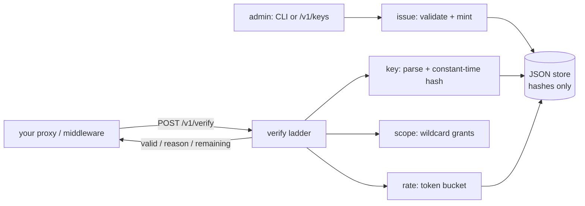

# keyturn

[English](README.md) | [中文](README.zh.md) | [日本語](README.ja.md)

[](LICENSE) [](go.mod) [](CHANGELOG.md)  [](CONTRIBUTING.md)

**keyturn：开源的 API key 服务，在一个验证端点背后完成 key 的签发、哈希、授权范围与限流 —— 它是你的代理调用的 sidecar，而不是要你整体迁移的网关平台。**


```bash
git clone https://github.com/JaydenCJ/keyturn && cd keyturn
go build -o keyturn ./cmd/keyturn    # single static binary, stdlib only
```

> 预发布说明：v0.1.0 尚未发布到任何包注册表；请按上述方式从源码构建（任何 Go ≥1.22 均可）。

## 为什么选 keyturn？

每个 API 产品最终都会重复造同样的四个轮子：key 生成、哈希存储、scope 校验、按 key 限流 —— 而现成方案全都带着附加条件。Unkey 这类托管 key 服务很出色但是云优先：你的鉴权路径从此依赖别人的可用性，key 的哈希也存放在别人那里。API 网关平台（Kong、Tyk）把 key 认证与路由层、数据库和一整套插件生态捆绑在一起，必须整体采用。自己手写看似简单，直到你撞上细节：常数时间比较、能撑过重启的令牌桶、真正能生效的吊销，以及"密钥错误"与"key 不存在"返回不同错误这种微妙的泄漏。keyturn 是缺失的中间层：一个持有单个 JSON 文件的静态二进制，对外只暴露 `POST /v1/verify`。你的代理或中间件把收到的 key 和路由要求的 scopes 发过来，keyturn 回答 `valid`、稳定的原因码和剩余额度。key 可以通过带 bearer token 的管理 API 签发，也可以完全离线用 CLI 签发 —— 令牌桶甚至持久化在 store 文件里，纯 CLI 场景也能获得真实的限流，零服务器。

| | keyturn | Unkey | Kong / Tyk | 手写方案 |
|---|---|---|---|---|
| 单端点验证 sidecar | ✅ | ❌ SDK + 云 API | ❌ 全套网关挡在链路上 | 自己写 |
| 完全离线 / 隔离网络可用 | ✅ | ❌ 托管优先 | ⚠️ 自托管 + 数据库 | ✅ |
| key 哈希落盘（SHA-256、常数时间比较） | ✅ | ✅ | ⚠️ 取决于插件 | 经常被忘掉 |
| 支持通配符授权的 scope（`read:*`） | ✅ | ✅ | ⚠️ ACL 插件 | 自己写 |
| 带精确重试提示的令牌桶限流 | ✅ | ✅ | ✅ | 自己写 |
| 密钥错误 ≡ key 不存在（防 ID 探测） | ✅ | ❓ 未见文档 | ❓ 未见文档 | 通常会泄漏 |
| 所需基础设施 | 无 —— 1 个二进制 + 1 个 JSON 文件 | 他们的云 | 数据库 + 网关节点 | 无 |
| 运行时依赖 | 0 | n/a（SaaS） | 数十个 | 不一定 |

<sub>依赖数量核对于 2026-07-13：keyturn 只导入 Go 标准库；Kong 3.x 自带 PostgreSQL/DB-less 配置层和 90+ 个 Lua rocks。</sub>

## 特性

- **只需集成一个端点** —— `POST /v1/verify` 接收 `{key, scopes, cost}`，返回 `{valid, reason, remaining, retry_after_ms}`；所有确定性回答都是 HTTP 200，传输故障与拒绝永远不会被混淆。
- **密钥只存在一瞬间** —— 完整 key 仅在创建时展示一次；store 只保留 SHA-256 哈希并以常数时间比较，`not_found` 刻意同时覆盖未知 ID 与密钥错误两种情况。
- **认真对待 scope** —— 授予 `read:*` 或 `billing:invoices:create`，按路由声明所需 scope，被拒绝的请求会精确报告缺了哪些 scope —— 且不消耗限流令牌。
- **确定性的令牌桶** —— 按 key 配置 `--rate 100/1m --burst 250`，连续回填并给出诚实的 `retry_after` 提示；限流器是注入时钟的纯函数，这正是 89 个测试无一 sleep 的原因。
- **零基础设施** —— 一个静态二进制、一个人类可读的 JSON store，以原子方式写入并设 0600 权限；CLI 会把消耗的令牌写回文件，无服务器场景跨调用也能正确限流。
- **默认即锁死** —— 绑定 127.0.0.1，无遥测，启动时不联网；不配置 bearer token 时管理 API 整体关闭。

## 快速上手

```bash
# 1. mint a key (the full key is printed once, then only its hash exists)
./keyturn create --name acme-prod --label live --scopes 'read:*,write:orders' --rate 100/1m

# 2. run the sidecar
./keyturn serve

# 3. your proxy/middleware verifies each request with one POST
curl -s http://127.0.0.1:7710/v1/verify \
  -d '{"key":"kt_live_x7bvrgw6sg_9wvmc5y8nd7sfdptnq997s4w78ab","scopes":["read:users"]}'
```

真实捕获的输出：

```text
key:     kt_live_x7bvrgw6sg_9wvmc5y8nd7sfdptnq997s4w78ab
id:      x7bvrgw6sg
name:    acme-prod
scopes:  read:*, write:orders
limit:   100/1m
expires: never
save this key now — keyturn stores only its hash and cannot show it again

keyturn 0.1.0 listening on http://127.0.0.1:7710 (store: keyturn.json, 1 key)
admin API: disabled (set --admin-token or KEYTURN_ADMIN_TOKEN to enable)

{
  "valid": true,
  "key_id": "x7bvrgw6sg",
  "name": "acme-prod",
  "label": "live",
  "scopes": [
    "read:*",
    "write:orders"
  ],
  "remaining": 99
}
```

拒绝路径同样明确（真实输出，请求了 key 未持有的 scope）：

```text
{
  "valid": false,
  "reason": "missing_scope",
  "key_id": "x7bvrgw6sg",
  "name": "acme-prod",
  "label": "live",
  "scopes": [
    "read:*",
    "write:orders"
  ],
  "missing_scopes": [
    "admin:all"
  ],
  "remaining": -1
}
```

CI 或 cron 的 key 不需要服务器 —— CLI 离线验证并把令牌桶持久化到 store 文件：

```bash
./keyturn verify kt_live_… --scopes read:users   # exit 0 valid, 1 denied
```

## 拒绝原因

验证阶梯按固定顺序执行 —— 解析 → 查找 → 哈希 → 吊销 → 过期 → scope → 限流 —— 第一个失败的环节给出答案。完整线协议参考见 [docs/verification-api.md](docs/verification-api.md)。

| 原因 | 含义 | 备注 |
|---|---|---|
| `malformed` | 形状不像 keyturn 的 key | 从不透露具体原因 |
| `not_found` | 未知 ID **或**密钥错误 | 刻意相同 —— 防止 ID 探测 |
| `disabled` | 已被 CLI 或管理 API 吊销 | `enable` 可恢复 |
| `expired` | 超过 `--expires` | 排他边界：*到达*该时刻即失效 |
| `missing_scope` | key 缺少所需 scope | 会列出缺项；不消耗令牌 |
| `rate_limited` | 令牌桶已空 | `retry_after_ms` 是诚实的提示 |

## CLI 参考

`keyturn [create|list|show|revoke|enable|delete|verify|serve|version]` —— 每个命令都读取 `--store PATH`（默认 `$KEYTURN_STORE` 或 `keyturn.json`）。退出码：0 成功/有效，1 拒绝，2 用法错误，3 运行时错误。

| 参数 | 默认值 | 作用 |
|---|---|---|
| `--name`（create） | 必填 | 人类可读的 key 名称，≤80 字符 |
| `--label`（create） | 无 | 嵌入 key 字符串的片段，如 `live`、`test` |
| `--scopes` | 无 | 逗号分隔的授予项（create）或要求项（verify） |
| `--rate`（create） | 不限 | `N/窗口`：`100/1m`、`10/s`、`5000/24h` |
| `--burst`（create） | = 速率数 | 应对突发的桶容量 |
| `--expires`（create） | 永不 | RFC 3339 或 `YYYY-MM-DD`（UTC 零点） |
| `--meta`（create） | 无 | `k=v` 注解，可重复 |
| `--cost`（verify） | `1` | 本次调用消耗的令牌数 |
| `--format` | `text` | `text` 或 `json`（JSON 与 HTTP 线格式一致） |
| `--addr`（serve） | `127.0.0.1:7710` | 监听地址；非回环地址会打印警告 |
| `--admin-token`（serve） | `$KEYTURN_ADMIN_TOKEN` | 启用 `/v1/keys`；不设置 = 管理 API 关闭 |

## 验证

本仓库不携带 CI；以上所有声明均由本地运行验证：

```bash
go test ./...            # 89 deterministic tests, offline, < 5 s
bash scripts/smoke.sh    # CLI + real sidecar end-to-end, prints SMOKE OK
```

## 架构



## 路线图

- [x] v0.1.0 —— 带标签/scope/过期/元数据的哈希 key 签发、通配符 scope 匹配、可持久化令牌桶、单端点 HTTP sidecar + bearer token 管理 API、离线 CLI 验证、89 个测试 + smoke 脚本
- [ ] 服务端令牌桶状态定期 + 关停时写回 store（目前重启会重置桶）
- [ ] `keyturn rotate ID` —— 重签密钥，保留 scope/限流/ID 谱系
- [ ] 验证结果缓存头（为亚毫秒级代理提供 `Cache-Control` 提示）
- [ ] 代理与 sidecar 之间可选 mTLS，用于非回环部署
- [ ] 同一接口后的 SQLite 存储后端，支撑 >100k key

完整列表见 [open issues](https://github.com/JaydenCJ/keyturn/issues)。

## 参与贡献

欢迎 issue、讨论与 PR —— 本地工作流（格式化、vet、测试、`SMOKE OK`）见 [CONTRIBUTING.md](CONTRIBUTING.md)。入门任务标注为 [good first issue](https://github.com/JaydenCJ/keyturn/issues?q=is%3Aissue+is%3Aopen+label%3A%22good+first+issue%22)，设计讨论在 [Discussions](https://github.com/JaydenCJ/keyturn/discussions)。

## 许可证

[MIT](LICENSE)
